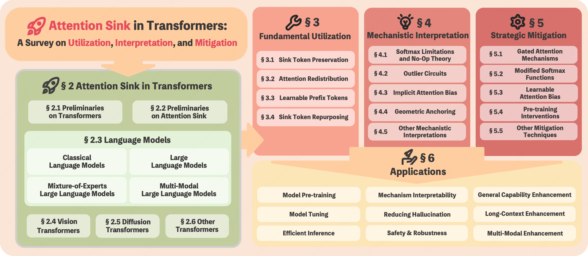

<h1 align="center">🚀 Attention Sink in Transformers: <br> A Survey on Utilization, Interpretation, and Mitigation</h1>

<div align="center">

[](https://arxiv.org/pdf/2604.10098)
[]()
[](https://arxiv.org/abs/2604.10098)

[](https://awesome.re)
[](https://github.com/ZunhaiSu/Awesome-Attention-Sink/stargazers)

</div>

<div align="center">
  ⭐ If you find this repository helpful, please consider giving it a star.
</div>

---

## 📚 Table of Contents

- [Latest News](#-latest-news)
- [Overview](#-overview)
- [Paper List](#-paper-list)
- [Citation](#-citation)
- [Contact](#-contact)

---

## 🔥 Latest News

- **[2026-06-05]** 📊 **Paper list migrated!** The surveyed paper list has been migrated to an online spreadsheet for easier querying and continuous updates. Access it here: [AS Paper List](https://bcn7isxnv9g2.feishu.cn/wiki/TWcVw0TmIi9F1ZkyZ3ac3z6onYe)
- **[2026-06-05]** 📚 **Update!** New version released with **50+ new papers** added. Thanks for all the feedback! In addition, due to the growing number of works on Attention Sink in DiTs, a dedicated **subsection** has been introduced. Further feedback and discussion are always welcome.
- **[2026-04-14]** ✨ We thank all related works for their contributions to AS-related research. We are currently fine-tuning the paper for journal submission. For any inquiries or to include your work in the paper list, please contact us at [zh-su23@mails.tsinghua.edu.cn](mailto:zh-su23@mails.tsinghua.edu.cn).
- **[2026-04-14]** 🎉 Our survey paper *"Attention Sink in Transformers: A Survey on Utilization, Interpretation, and Mitigation"* is now available on arXiv! [[Link](https://arxiv.org/abs/2604.10098)]
- **[2026-04-11]** 🚀 Repository launched to track the latest progress in Attention Sink research.

---

## 📖 Overview

This repository organizes papers on **Attention Sink (AS)** — where Transformers disproportionately focus on uninformative tokens, causing interpretability issues, training/inference inefficiencies, and hallucinations.

<div align="center">
  
  <br>
  <em>Figure 1: Overview of the survey structure.</em>
</div>

<br>

**We have systematically reviewed the development of AS research**, identifying a clear trajectory across three stages. Our survey further grounds this framework by examining how each stage manifests across different Transformer architectures.

<div align="center">
  
  <br>
  <em>Figure 2: Cumulative publication count and temporal trends in AS research (2023–2026).</em>
</div>

<br>

### Three Research Stages

**① Fundamental Utilization** (2023–present)
> Empirical exploitation of AS and management of its immediate effects.
> *Approaches include:* Sink Token Preservation, Attention Redistribution, Learnable Prefix Tokens, Sink Token Repurposing.

**② Mechanistic Interpretation** (2024–present)
> Investigation of underlying causes and architectural factors.
> *Theories include:* Softmax Limitations & No-Op Theory, Outlier Circuits, Implicit Attention Bias, Geometric Anchoring and others.

**③ Strategic Mitigation** (2025–present)
> Direct structural mitigation for training stability and deployment robustness.
> *Strategies include:* Gated Attention Mechanisms, Modified Softmax Functions, Learnable Attention Bias, Pre-training Interventions and others.

---

## 📑 Paper List

**To facilitate efficient querying and continuous updates, we have transitioned to an online spreadsheet:**

> Each paper is annotated with tags that correspond to three core dimensions of Attention Sink (AS): Fundamental Utilization, Mechanistic Interpretation, and Strategic Mitigation, along with its Application Domain.

👉 **AS Paper List:** [https://bcn7isxnv9g2.feishu.cn/wiki/TWcVw0TmIi9F1ZkyZ3ac3z6onYe](https://bcn7isxnv9g2.feishu.cn/wiki/TWcVw0TmIi9F1ZkyZ3ac3z6onYe)

If you identify any errors or omissions in the list of Attention-Sink-related papers, please contact zh-su23@mails.tsinghua.edu.cn. We greatly appreciate your contributions and feedback.

## 🌟 Citation

If you find this survey or repository useful for your research, please cite:

```bibtex
@article{su2026attention,
  title={Attention Sink in Transformers: A Survey on Utilization, Interpretation, and Mitigation},
  author={Su, Zunhai and Zhang, Hengyuan and Wu, Wei and Zhang, Yifan and Liu, Yaxiu and Xiao, He and Yang, Qingyao and Sun, Yuxuan and Yang, Rui and Zhang, Chao and others},
  journal={arXiv preprint arXiv:2604.10098},
  year={2026}
}
```

## 📧 Contact

Feel free to open an issue or contact us if you have any questions or want to include your work in this list.

Corresponding Author: Zunhai Su (zh-su23@mails.tsinghua.edu.cn)
